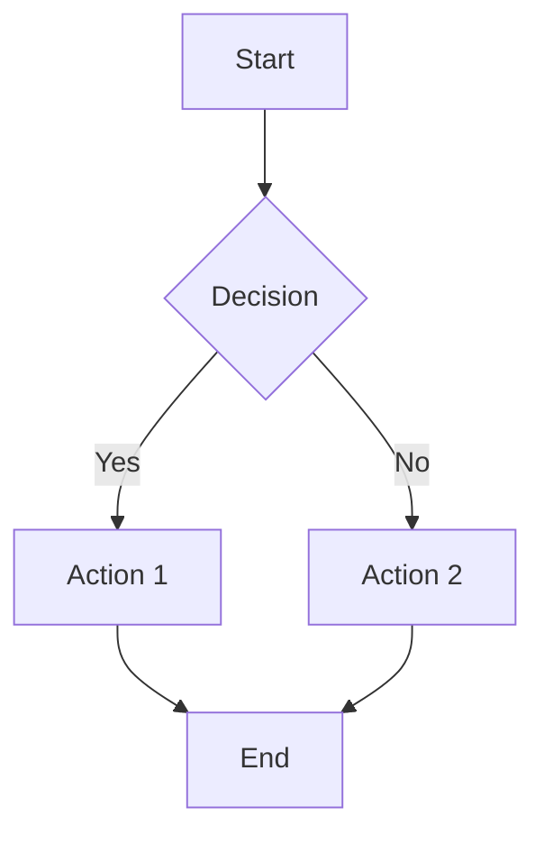
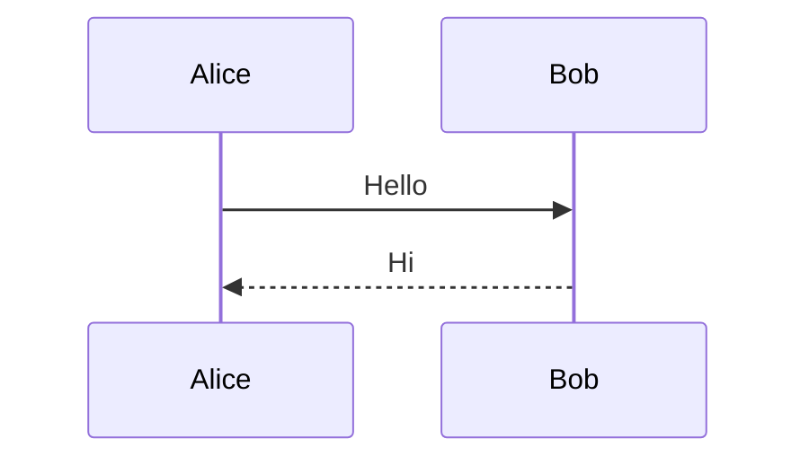
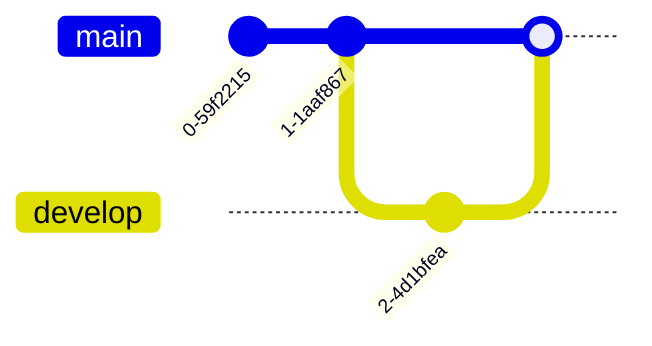
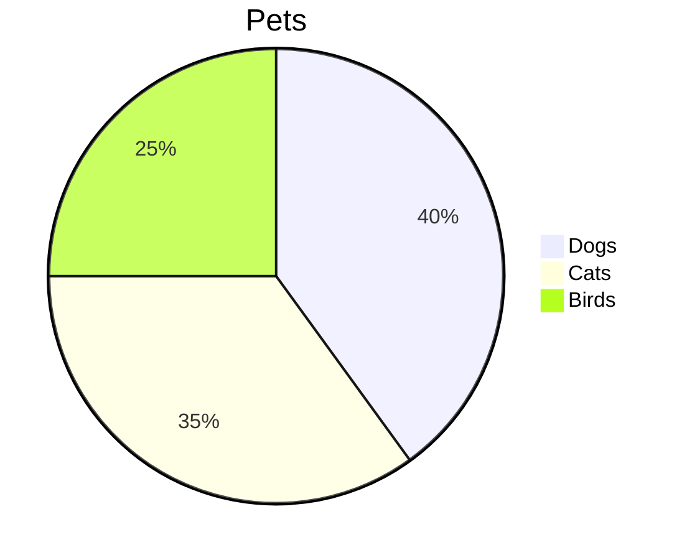
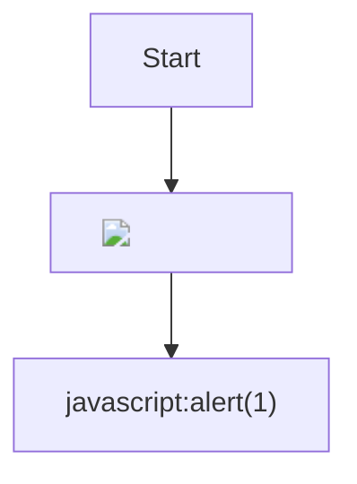

# Mermaid Diagrams

## Flowchart



## Sequence Diagram



## Git Graph



## Mermaid with code after

Regular text after mermaid.

```typescript
const x = 42;
```

## Multiple mermaid blocks



## Malicious mermaid (external reference)

