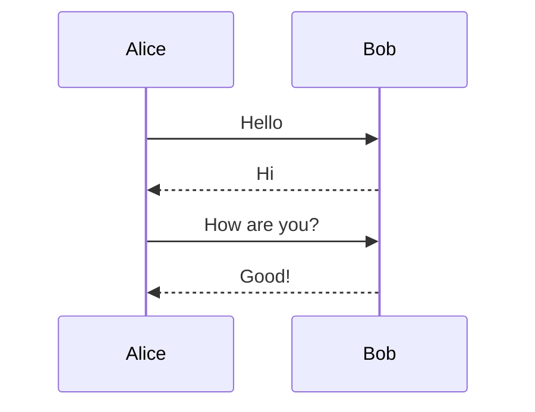
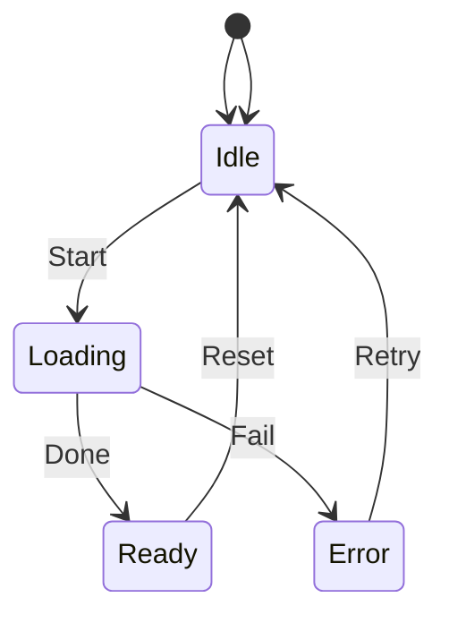
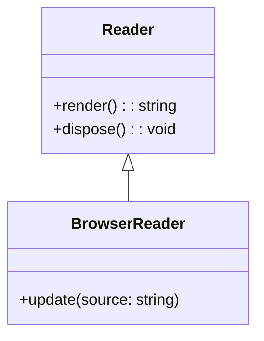
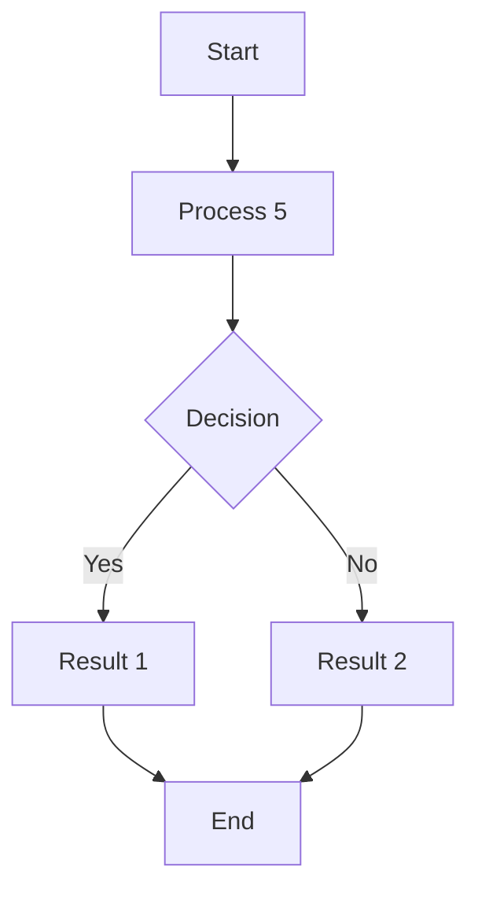
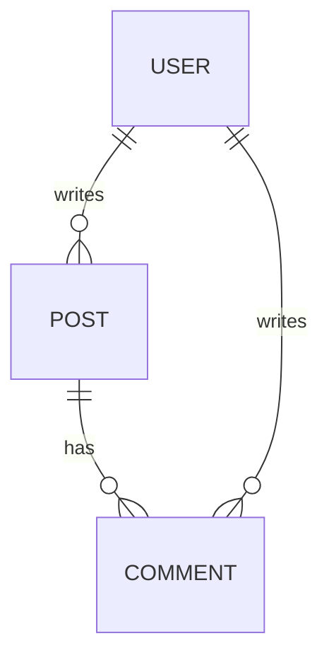
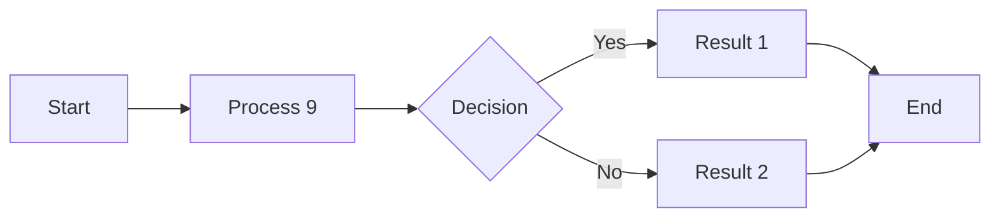
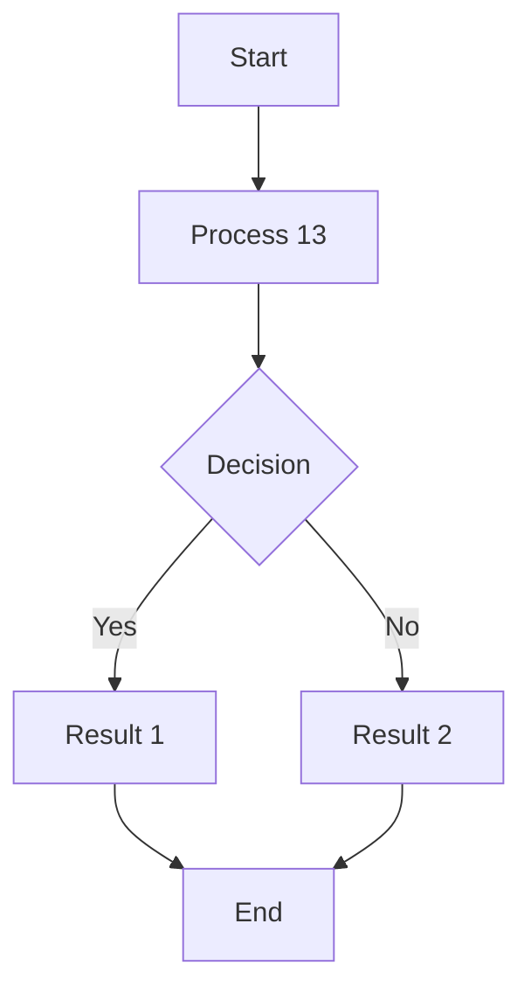
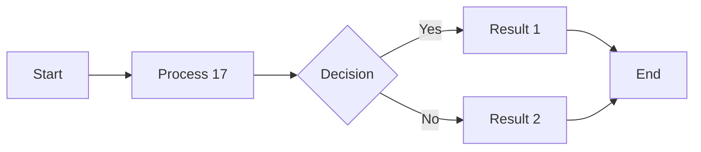

# Diagram-Heavy Document

This fixture contains many Mermaid diagrams.

## Diagram 1


Diagram 1 description text.

## Diagram 2


Diagram 2 description text.

## Diagram 3



Diagram 3 description text.

## Diagram 4



Diagram 4 description text.

## Diagram 5



Diagram 5 description text.

## Diagram 6



Diagram 6 description text.

## Diagram 7


Diagram 7 description text.

## Diagram 8



Diagram 8 description text.

## Diagram 9

```mermaid
graph TD
  A[Start] --> B[Process 8]
  B --> C{Decision}
  C -->|Yes| D[Result 1]
  C -->|No| E[Result 2]
  D --> F[End]
  E --> F
```

Diagram 9 description text.

## Diagram 10



Diagram 10 description text.

## Diagram 11

```mermaid
sequenceDiagram
  participant Alice
  participant Bob
  Alice->>Bob: Hello
  Bob-->>Alice: Hi
  Alice->>Bob: How are you?
  Bob-->>Alice: Good!
```

Diagram 11 description text.

## Diagram 12


Diagram 12 description text.

## Diagram 13


Diagram 13 description text.

## Diagram 14



Diagram 14 description text.

## Diagram 15


Diagram 15 description text.

## Diagram 16


Diagram 16 description text.

## Diagram 17

```mermaid
graph TD
  A[Start] --> B[Process 16]
  B --> C{Decision}
  C -->|Yes| D[Result 1]
  C -->|No| E[Result 2]
  D --> F[End]
  E --> F
```

Diagram 17 description text.

## Diagram 18



Diagram 18 description text.

## Diagram 19


Diagram 19 description text.

## Diagram 20


Diagram 20 description text.

## Diagram 21

```mermaid
classDiagram
  class Reader {
    +render(): string
    +dispose(): void
  }
  class BrowserReader {
    +update(source: string)
  }
  Reader <|-- BrowserReader
```

Diagram 21 description text.

## Diagram 22

```mermaid
flowchart TD
  A[Start] --> B[Process 21]
  B --> C{Decision}
  C -->|Yes| D[Result 1]
  C -->|No| E[Result 2]
  D --> F[End]
  E --> F
```

Diagram 22 description text.

## Diagram 23

```mermaid
flowchart LR
  A[Start] --> B[Process 22]
  B --> C{Decision}
  C -->|Yes| D[Result 1]
  C -->|No| E[Result 2]
  D --> F[End]
  E --> F
```

Diagram 23 description text.

## Diagram 24

```mermaid
erDiagram
  USER ||--o{ POST : writes
  POST ||--o{ COMMENT : has
  USER ||--o{ COMMENT : writes
```

Diagram 24 description text.

## Diagram 25

```mermaid
graph TD
  A[Start] --> B[Process 24]
  B --> C{Decision}
  C -->|Yes| D[Result 1]
  C -->|No| E[Result 2]
  D --> F[End]
  E --> F
```

Diagram 25 description text.

## Diagram 26

```mermaid
graph LR
  A[Start] --> B[Process 25]
  B --> C{Decision}
  C -->|Yes| D[Result 1]
  C -->|No| E[Result 2]
  D --> F[End]
  E --> F
```

Diagram 26 description text.

## Diagram 27

```mermaid
sequenceDiagram
  participant Alice
  participant Bob
  Alice->>Bob: Hello
  Bob-->>Alice: Hi
  Alice->>Bob: How are you?
  Bob-->>Alice: Good!
```

Diagram 27 description text.

## Diagram 28

```mermaid
stateDiagram-v2
  [*] --> Idle
  Idle --> Loading: Start
  Loading --> Ready: Done
  Loading --> Error: Fail
  Ready --> Idle: Reset
  Error --> Idle: Retry
  [*] --> Idle
```

Diagram 28 description text.

## Diagram 29

```mermaid
classDiagram
  class Reader {
    +render(): string
    +dispose(): void
  }
  class BrowserReader {
    +update(source: string)
  }
  Reader <|-- BrowserReader
```

Diagram 29 description text.

## Diagram 30

```mermaid
flowchart TD
  A[Start] --> B[Process 29]
  B --> C{Decision}
  C -->|Yes| D[Result 1]
  C -->|No| E[Result 2]
  D --> F[End]
  E --> F
```

Diagram 30 description text.

## Diagram 31

```mermaid
flowchart LR
  A[Start] --> B[Process 30]
  B --> C{Decision}
  C -->|Yes| D[Result 1]
  C -->|No| E[Result 2]
  D --> F[End]
  E --> F
```

Diagram 31 description text.

## Diagram 32

```mermaid
erDiagram
  USER ||--o{ POST : writes
  POST ||--o{ COMMENT : has
  USER ||--o{ COMMENT : writes
```

Diagram 32 description text.

## Diagram 33

```mermaid
graph TD
  A[Start] --> B[Process 32]
  B --> C{Decision}
  C -->|Yes| D[Result 1]
  C -->|No| E[Result 2]
  D --> F[End]
  E --> F
```

Diagram 33 description text.

## Diagram 34

```mermaid
graph LR
  A[Start] --> B[Process 33]
  B --> C{Decision}
  C -->|Yes| D[Result 1]
  C -->|No| E[Result 2]
  D --> F[End]
  E --> F
```

Diagram 34 description text.

## Diagram 35

```mermaid
sequenceDiagram
  participant Alice
  participant Bob
  Alice->>Bob: Hello
  Bob-->>Alice: Hi
  Alice->>Bob: How are you?
  Bob-->>Alice: Good!
```

Diagram 35 description text.

## Diagram 36

```mermaid
stateDiagram-v2
  [*] --> Idle
  Idle --> Loading: Start
  Loading --> Ready: Done
  Loading --> Error: Fail
  Ready --> Idle: Reset
  Error --> Idle: Retry
  [*] --> Idle
```

Diagram 36 description text.

## Diagram 37

```mermaid
classDiagram
  class Reader {
    +render(): string
    +dispose(): void
  }
  class BrowserReader {
    +update(source: string)
  }
  Reader <|-- BrowserReader
```

Diagram 37 description text.

## Diagram 38

```mermaid
flowchart TD
  A[Start] --> B[Process 37]
  B --> C{Decision}
  C -->|Yes| D[Result 1]
  C -->|No| E[Result 2]
  D --> F[End]
  E --> F
```

Diagram 38 description text.

## Diagram 39

```mermaid
flowchart LR
  A[Start] --> B[Process 38]
  B --> C{Decision}
  C -->|Yes| D[Result 1]
  C -->|No| E[Result 2]
  D --> F[End]
  E --> F
```

Diagram 39 description text.

## Diagram 40

```mermaid
erDiagram
  USER ||--o{ POST : writes
  POST ||--o{ COMMENT : has
  USER ||--o{ COMMENT : writes
```

Diagram 40 description text.

